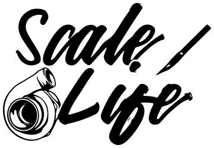

## 124ScaleLife.com

124ScaleLife.com is both a privately owned small business and a website for the 1:24 scale model community.
We are a small business that is dedicated to providing the best customer service and products to our customers.
We are also a community of modelers that are dedicated to helping each other and sharing our knowledge and experience
with each other and the world.

We are backed by the developers at [Enyutech][enyutech] and are built on the [Laravel][laravel] framework.
This project is semi-open-sourced software licensed under the [124ScaleLife Source License][license] and subject to the
[Contributor License Agreement][cla].

> **Note: The 124ScaleLife.com website is currently under development and is not yet ready for production use.**

## Contributing

Thank you for considering contributing to 124ScaleLife.com! The contribution guide can be found in
the [CONTRIBUTING.md][contributing] document.

## Code of Conduct

In order to ensure that the 124ScaleLife community is welcoming to all, please review and abide by
the [Code of Conduct][code-of-conduct].

## Security Vulnerabilities

If you discover a security vulnerability within the 124ScaleLife.com source code, please send an e-mail to
the project's lead developer and code owner [David Rodriguez][code-owner] via [david@enyutech.com][code-owner-email].
All security vulnerabilities will be promptly addressed.

## License

The 124ScaleLife.com source code is open-sourced software licensed under
the [124ScaleLife Source License][license] and subject to the [Contributor License Agreement][cla].

[enyutech]: https://enyutech.com

[laravel]: https://laravel.com

[license]: ./LICENSE.md

[cla]: ./docs/CLA.md

[contributing]: ./docs/CONTRIBUTING.md

[code-of-conduct]: ./docs/CodeOfConduct.md

[code-owner]: https://github.com/davidsaulrodriguez

[code-owner-email]: mailto:david@enyutech.com
